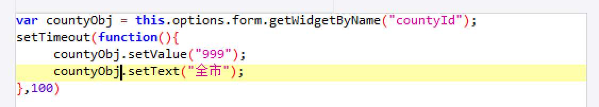
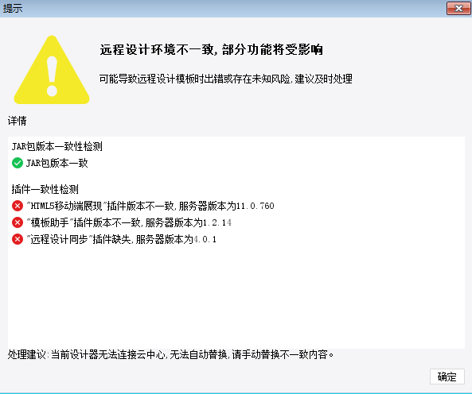

## 帆软现阶段问题
### 1、日志不能定期清除

配置的是每周都清理，但是节点上还有2021年的文件
### 2、登录集成插件即将过期

#### P.S. 测试在移动端插件失效，请确认该插件是否可以工作在移动端

### 3、设计器进程驻留问题
#### ① 当打开frm模板时，高频发生退出设计器但进程仍在问题再次打开设计器会提示端口占用
#### ② 当设计器长时间打开，退出时候也会出现进程不退出的现象

### ~~4、license被置换成临时lic~~
~~生产集群环境之前正式license的注册的tomcat，后又增加一个节点，用临时lic重新注册后，原先三台正式lic的也变成临时的了~~

### 5、设计器同步问题
#### 插件同步问题依然存在，请确认该功能测试正常。

### ~~6、在WEB-INFO/reportlets目录下FineReport.Reuse目录是做什么用的，是否可以删除~~
## 7、控件编辑后事件 不能立即起作用，需要setTimeout才可以，涉及报表很广，有什么办法统一更改

目前可以使用promise来解决，但是涉及到的地方太多，统一更改需要复杂的正则表达式，有风险
## 8、frm报表里面的数据集查询不能同步进行，大屏响应时间很慢
如下图，请求时间9秒，是两个请求时间之和，能够改成异步的

### ~~9、如何更改cubes日志的存放位置~~
得到的答复是不可以更改位置
### 10、导出功能能不能（比如使用插件）增加权限校验
此功能使用付费插件，要和金库集成仍不是很方便，不知道通过二次开发能否解决
等帆软工程师来现场，演示一下目前的金库集成情况，再讨论解决方案
### 11、切换远程服务器时候比8.0的时候慢
是否网络问题，还是产品有多了什么校验
### 12、地图配置是否可做到热更新。
目前山东现场的网格geojson更新后需要重启服务才能生效
### 13、帆软日志报错如何定位错误
比如报错数据集配置错误，如何查定位到哪张模板哪个数据集

### 14、seesion同步工具问题，报错找不到session 
https://github.com/redisson/redisson/tree/master/redisson-tomcat

### 15、alphaFine 断网查询仍然缓慢

### 16、咨询：帆软fr11.0与10.0的区别；讨论：升级方案风险评估

### 17、cloud.fanruan.com 无法访问
### 18、设计器连接使用nginx地址或者节点地址有什么区别
### 19、宕机定位问题。
### 20、https登录问题
### 21、如何开发一个插件

### 22、 oem 同步插件问题
1. 插件同步要做到服务器删除插件，更新，新增，设计器端要同步处理，不能只是新增插件的时候同步
2. oem软件安装完成后，webroot/WEB-INF/下的jar报表会和服务器端的jar包重复，比如mysql的驱动包，同时存在两个版本：5.1.49（软件自带），8.0.27（服务器端）
3. 插件一致性检测

# 2023-07-05
## 1、智能运维-负载管理-模板限制 是否可以修改数据库中的值
## 2、智能运维-宕机处理-dump解析
## 3、开放平台-报表数据服务 模板里只有一列数据的话会报错

# 帆软报表迁移 2023-08-29
### 1、帆软服务程序（生产、测试）备份；金库服务备份
### 2、软件环境准备：jdk、linux字体、tomcat，redis服务，文件服务器等配置
### 3、帆软服务部署，验证数据源；金库服务部署
### 4、帆软服务相关迁移通知：山东侧经分、iop、crm，谛听，H5领导日报、融网格等相关服务适配新地址（涉及多个厂商：卓望数码，亚信、华为、浩鲸等）
### 5、设计器安装：开发组、维护组、山东各地市帆软服务使用侧适配新地址（ip、端口）
### 6、帆软服务更新license

### ip限制
https://help.fanruan.com/finereport/doc-view-5287.html#

http://www.finereport.com/   18662720535 zhaomingxuanhw 李小伟         
http://www.finereporthelp.com/ 

http://bbs.finereport.com/

fe378823-babc443be-a78e-5519c84f7114    
0b9e714a-cef954a99-b64e-59550d400a3b
b70f007a-e41634e59-a325-d9148b4af363

fdsfa
  dfdsf

到底