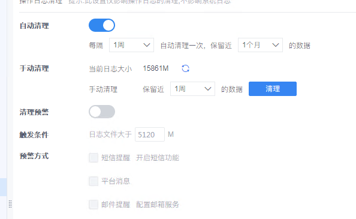

## 帆软现阶段问题
### 1、日志不能定期清除

配置的是每周都清理，但是节点上还有2021年的文件
### 2、登录集成插件即将过期

#### P.S. 测试在移动端插件失效，请确认该插件是否可以工作在移动端

### 3、设计器进程驻留问题
#### ① 当打开frm模板时，高频发生退出设计器但进程仍在问题再次打开设计器会提示端口占用
#### ② 当设计器长时间打开，退出时候也会出现进程不退出的现象

### 4、license被置换成临时lic
生产集群环境之前正式license的注册的tomcat，后又增加一个节点，用临时lic重新注册后，原先三台正式lic的也变成临时的了

### 5、设计器同步问题
#### 插件同步问题依然存在，请确认该功能测试正常。
